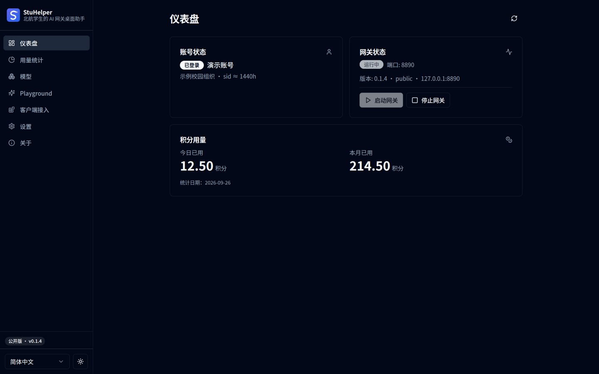
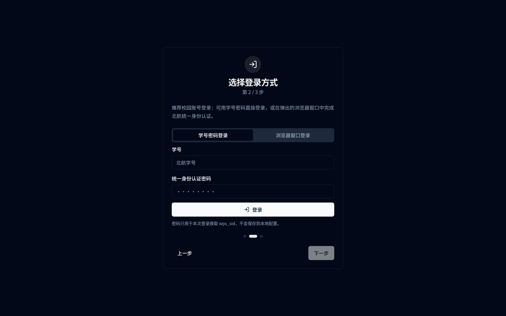
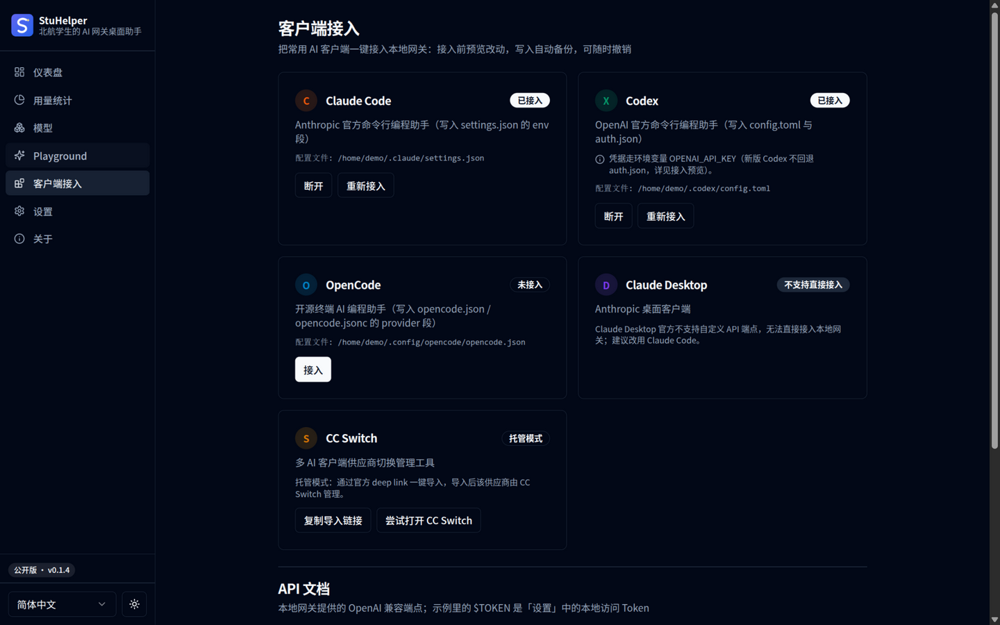
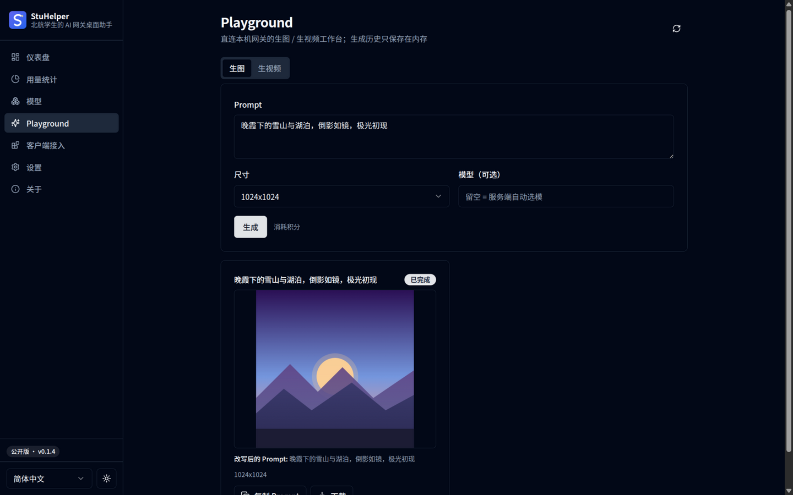
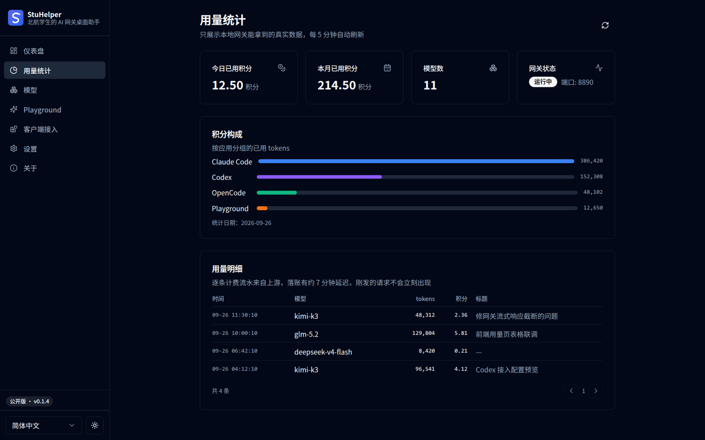
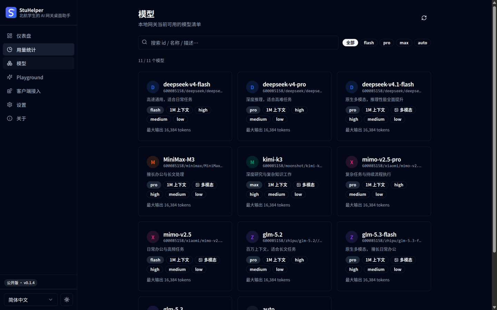
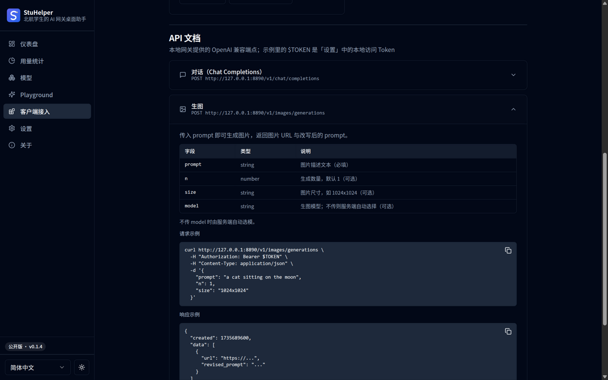

# ✈️ StuHelper

**北航同学的 AI 网关桌面助手 —— 一键接入 Claude Code / Codex 等 AI 编程工具**

> ⚠️ 本仓库**只提供安装包下载**，没有源代码（产品需要）。遇到问题到文末看排查或找作者。

---

## 📸 界面预览

  

| 🔑 统一身份认证登录 | 🔌 客户端一键接入 | 🎨 Playground 生图 |
| :---: | :---: | :---: |
|  |  |  |
| **📊 用量统计** | **🧠 模型卡片** | **📖 内置 API 文档** |
|  |  |  |

## 📥 下载安装

到 👉 [**Releases 页面**](https://github.com/Micraow/MoonBridge-Release/releases/latest) 下载对应你系统的安装包：

| 系统 | 下载哪个 | 装完怎么开 |
| --- | --- | --- |
| 🪟 **Windows** | `StuHelper-v*-windows.msi` | 双击安装 → 开始菜单找 StuHelper |
| 🍎 **macOS（M 系列芯片）** | `StuHelper-v*-macos-arm64.dmg` | 拖进「应用程序」→ 首次打不开就到「设置 → 隐私与安全性」点「仍要打开」 |
| 🐧 **Linux（简单）** | `StuHelper-v*-linux.AppImage` | `chmod +x` 后双击/命令行运行 |
| 🐧 **Linux（deb 系）** | `StuHelper-v*-linux.deb` | `sudo dpkg -i StuHelper-v*-linux.deb` |
| 🏔️ **Arch Linux** | 已上架 [AUR](https://aur.archlinux.org/packages/stuhelper-bin) | `yay -S stuhelper-bin`（或 `paru -S stuhelper-bin`）→ 自动跟随更新 |

## 🚀 三分钟上手

1. **打开应用**，跟着引导走（首次会看到隐私说明）。
2. **登录**：输入你的**统一身份认证学号和密码**（就是北航信息门户那套），
   也可以选「浏览器窗口登录」。凭据只存在你自己的电脑上。
3. 回到主页，点 **启动网关**（状态变成绿色「运行中」）。
4. 打开 **客户端接入** 页，点一下你用的工具（Claude Code / Codex / OpenCode）旁的 **接入**，
   它会帮你把配置写好。
5. 想用生图/生视频？侧边栏有 **Playground**，直接输提示词就能玩。

> 💡 更新是**自动的**：开着应用联网时，有新版本会自己下载替换，不用重装。

## 🧩 常见小问题

- **点 X 关不掉？** 那不是关不掉，是默认「直接退出」的；想留后台托盘就在
  「设置 → 窗口」里打开「点 X 最小化到托盘」。
- **提示凭据失效？** 在「设置」里重新登录一次即可（学号密码不会离开本机）。
- **客户端连不上？** 看主页网关是不是「运行中」，端口是不是和客户端配的一致。
- **macOS 报「已损坏」？** 设置 → 隐私与安全性 → 仍要打开（App 没做苹果公证，属正常提示）。

## ❤️ 相关链接

- 🌐 作者的博客：[pengs.top](https://pengs.top)
- 🤖 同门平台：[NewAPI](https://newapi.stuhelper.com)
- ⭐ 觉得好用就点个 Star 呗

Made with 💙 by StuHelper Team · 仅限北航同学个人学习使用，请勿商用

